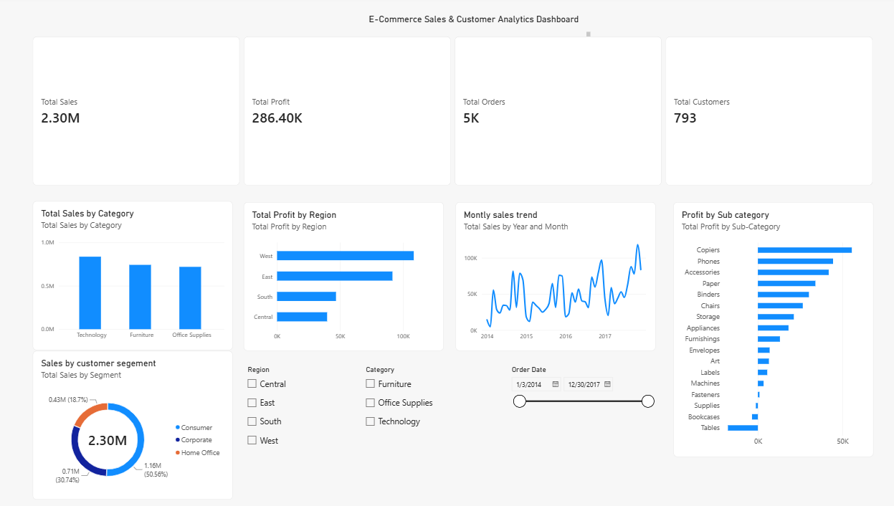

# E-Commerce Sales & Customer Analytics

## Project Overview
This project presents an end-to-end analysis of an e-commerce sales dataset using Python and Power BI. The objective is to analyze sales performance, profitability, customer segments, product categories, regional performance, and sales trends to generate useful business insights.

## Problem Statement
The business needs to understand its overall sales and profitability, identify high and low-performing categories and regions, analyze customer segments, and determine factors that may affect profitability. This project uses data analytics and visualization techniques to support data-driven business decisions.

## Dataset Description
The Superstore Sales dataset contains 9,994 records covering customer orders, products, sales, quantity, discounts, and profit.

Important fields include:
- Order ID
- Order Date
- Customer ID
- Customer Name
- Segment
- Region
- Category
- Sub-Category
- Product Name
- Sales
- Quantity
- Discount
- Profit

## Tools Used
- Python
- Pandas
- NumPy
- Matplotlib
- Jupyter Notebook
- Power BI
- Git
- GitHub

## Data Cleaning Process
The dataset was inspected and prepared before analysis.

- Checked dataset dimensions and column names.
- Examined column data types.
- Checked for missing values.
- Checked for duplicate records.
- Converted Order Date and Ship Date to datetime format.
- Removed the unnecessary Row ID column.
- Checked for invalid sales, quantity, and discount values.
- Saved a cleaned version of the dataset for analysis.

No missing values or duplicate records were identified in the dataset.

## Exploratory Data Analysis
EDA was performed to understand the dataset and identify important patterns.

The analysis included:
- Descriptive statistics
- Sales and profit analysis
- Category performance
- Regional performance
- Customer segment analysis
- Monthly sales trends
- Correlation analysis
- Outlier detection

## Data Visualizations
The following visualizations were created using Python:

1. Total Sales by Category
2. Total Profit by Region
3. Monthly Sales Trend
4. Sales Distribution by Customer Segment
5. Sales vs Profit
6. Sales Outlier Analysis

## Power BI Dashboard
An interactive Power BI dashboard was developed to summarize the major business metrics.

### Dashboard Preview

### KPI Cards
- Total Sales
- Total Profit
- Total Orders
- Total Customers

### Dashboard Visualizations
- Sales by Category
- Profit by Region
- Monthly Sales Trend
- Sales by Customer Segment
- Profit by Sub-Category

### Interactive Filters
- Region
- Category
- Order Date

## Key Insights
1. Technology was the highest-performing category, generating approximately $836K in sales and $145K in profit.
2. Furniture generated high sales but comparatively low profit, indicating weak profitability.
3. The West region was the strongest-performing region in both sales and profit.
4. The South region recorded the lowest total sales.
5. November 2017 recorded the highest monthly sales at approximately $118.45K.
6. Discount and Profit showed a negative correlation, suggesting that higher discounts may reduce profitability.
7. The Consumer segment contributed the largest share of total sales.

## Business Recommendations
1. Review Furniture pricing, costs, and discount strategies to improve profitability.
2. Strengthen marketing and sales strategies in underperforming regions, particularly the South.
3. Optimize discount policies to avoid excessive discounting on low-margin products.

## Conclusion
The project demonstrates how data analytics can transform raw sales data into actionable business insights. Technology and the West region were major contributors to performance, while Furniture profitability and South-region sales provide opportunities for improvement.

## Project Structure

    ecommerce-sales-analytics/
    ├── data/
    │   ├── superstore_sales.csv
    │   └── cleaned_superstore_sales.csv
    ├── notebooks/
    │   └── ecommerce_analysis.ipynb
    ├── dashboard/
    │   └── ecommerce_sales_dashboard.pbix
    ├── images/
    ├── presentation/
    └── README.md

## Author
Saipraneeth